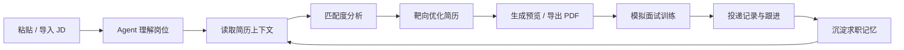
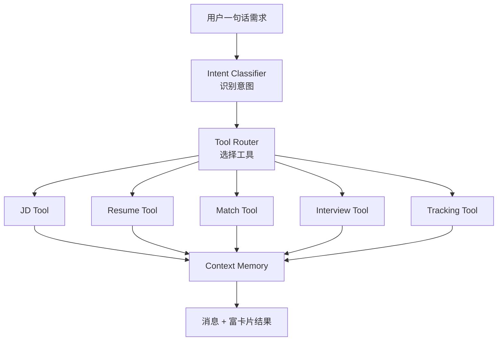

<div align="center">

# TieLink

### 一个会推进求职流程的 AI Agent 工作台

从一段 JD 开始，串起简历诊断、靶向优化、模拟面试、投递追踪和复盘沉淀。  
TieLink 不是「又一个 AI 聊天框」，而是一个围绕求职闭环设计的移动端智能体。

<p>
  
  
  
  
</p>


</div>

---

## 项目是什么

TieLink 是一款面向应届生、转行者和在职跳槽者的 Android 求职助手。它把求职过程中最容易散掉的环节收拢到同一个 Agent 工作台里：用户只需要说出目标，Agent 负责判断意图、补齐信息、调用工具、展示结果，并把有价值的上下文保存下来。

它的产品心智很明确：

> 聊天不是终点，聊天是推进下一步求职动作的入口。

你可以把 TieLink 理解成一个随身求职顾问。它不会停留在“我给你一些建议”，而是尽量把建议变成可确认、可编辑、可导出、可追踪的具体产物。

## 高光能力

| 能力 | 它做什么 |
| --- | --- |
| Agent 对话主入口 | 用自然语言触发 JD 分析、简历优化、面试训练、投递记录等工具 |
| 富卡片结果流 | 匹配度、简历预览、差异对比、面试轮次、投递状态都以卡片呈现 |
| JD 靶向匹配 | 提取岗位要求，结合简历计算关键词、技能、经验、学历等维度得分 |
| 简历优化闭环 | 支持导入、解析、改写、量化、版本管理、HTML/PDF 导出 |
| 多角色模拟面试 | 温和技术面、压力面、外企 HR、国企结构化、自定义面试官 |
| 投递追踪看板 | 管理公司、岗位、状态和时间线，让每一次投递都有后续 |
| 求职上下文记忆 | 围绕 JD、简历、面试沉淀可复用信息，越用越懂当前求职状态 |
| 双 AI 后端 | 支持 DeepSeek API 和本地/局域网 Ollama，可按配置自动切换 |

## 工作流一眼看懂



## Agent 如何工作



## 核心场景

### 1. 看 JD，判断值不值得投

把岗位描述贴进 TieLink，Agent 会解析职位、公司、职责、硬性要求和加分项，再结合简历生成匹配度报告。你能看到自己强在哪里、缺在哪里，以及哪些经历可以迁移表达。

```text
帮我分析这个 JD，我的简历匹配吗？
```

### 2. 改简历，但不盲改

TieLink 会围绕当前 JD 做靶向优化，而不是把简历改成一篇漂亮但失焦的文章。它可以做 STAR 改写、数据量化、关键词补强、版本保存和差异对比。

```text
把这段项目经历改得更像后端开发岗位需要的表达。
```

### 3. 练面试，练真实追问

选择不同面试官人格后，Agent 会进入面试模式。它不是只问固定题库，而是根据你的回答继续追问，并在结束后给出维度评分和改进建议。

```text
用压力面试的方式帮我练一下这个岗位。
```

### 4. 管投递，别让机会散掉

每一次投递都可以记录公司、岗位、简历版本、当前状态和备注。状态流转会形成时间线，方便后续复盘和跟进。

```text
记录一下，我今天投了字节的后端开发岗位。
```

## 技术架构

TieLink 采用 Clean Architecture + MVVM，把 UI、领域逻辑和数据层拆开，方便后续扩展新的 Agent 工具。

```text
UI Layer
  Compose Screens, ViewModels, Rich Cards

Domain Layer
  Models, UseCases, NLP, Semantic Matching, Agent Tools

Data Layer
  Room, DataStore, Repository, Remote Provider, File Parser

AI Provider Layer
  DeepSeek, Ollama, Local Embedding Fallback
```

## 技术栈

| 分类 | 选型 |
| --- | --- |
| 开发语言 | Kotlin |
| UI | Jetpack Compose, Material 3 |
| 架构 | MVVM, Clean Architecture |
| 导航 | Navigation Compose |
| 依赖注入 | Hilt, KSP |
| 本地存储 | Room, DataStore |
| 网络通信 | Retrofit, OkHttp |
| JSON | Moshi |
| AI 接入 | DeepSeek API, Ollama |
| 本地语义 | TensorFlow Lite Embedding |
| OCR | ML Kit Chinese Text Recognition |
| 文件能力 | PDF/DOCX 文本解析, HTML/PDF 导出 |
| 性能 | Baseline Profile |

## 项目结构

```text
.
├── app/
│   └── src/main/java/com/example/tielink/
│       ├── automation/          # BOSS 岗位导入相关能力
│       ├── data/                # Repository、Room、DataStore、AI Provider
│       ├── domain/              # 领域模型、NLP、UseCase、Agent Tool
│       ├── navigation/          # Compose 路由
│       ├── ui/                  # 页面、富卡片、组件、主题
│       └── util/                # 文件解析、HTML/PDF 导出、日志
├── baselineprofile/             # Baseline Profile
├── docs/                        # PRD、技术方案、升级文档
├── gradle/                      # Version Catalog
├── sample_classic_resume.html   # 简历模板示例
└── sample_vibe_resume.html      # 简历模板示例
```

## 快速开始

使用 Android Studio 打开项目，等待 Gradle 同步完成后运行 `app` 模块即可。

命令行构建：

```bash
./gradlew assembleDebug
```

Windows：

```powershell
.\gradlew.bat assembleDebug
```

运行后进入设置页配置 AI 服务：

| Provider | 配置项 |
| --- | --- |
| DeepSeek | API Key、Base URL、模型名 |
| Ollama | Ollama 地址、模型名 |
| Local | 本地 Embedding 能力，用于语义匹配兜底 |

## 当前进度

已完成或已有原型：

- Agent 对话主入口
- 工具调用协议与富卡片展示
- JD 分析与全局 JD 状态
- 简历导入、优化、版本、预览与导出
- 匹配度分析与技能差距提示
- 模拟面试与面试评估
- 投递状态管理
- DeepSeek / Ollama Provider 切换
- BOSS 岗位导入相关基础能力

持续打磨中：

- 更稳定的 Agent 工具编排
- 更细的简历差异对比
- 真实面试录音复盘
- 投递提醒与跟进节奏
- 多平台岗位导入
- 求职知识库长期记忆

## 设计原则

- **垂直优先**：只围绕求职闭环做深，不做泛聊天。
- **结果可确认**：重要修改先展示差异，再由用户确认。
- **动作可追踪**：简历版本、投递记录、面试复盘都要能回看。
- **上下文可沉淀**：让每一次 JD、简历、面试都成为下一次决策的材料。
- **Provider 可替换**：AI 能力通过统一 Provider 层接入，方便切换云端或本地模型。

## License

当前仓库暂未声明开源许可证。正式公开前建议补充 `LICENSE` 文件。
